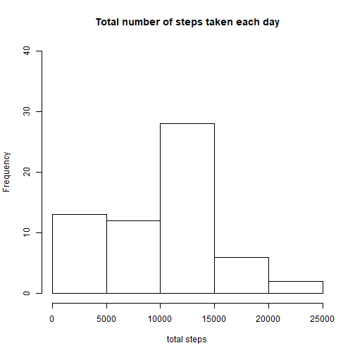
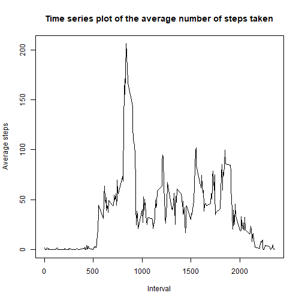
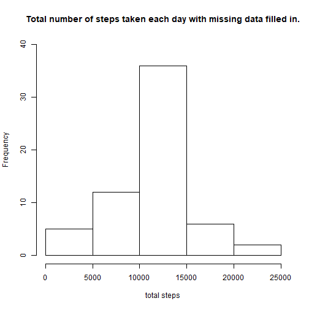

## 1. Loading and preprocessing the data


```r
library(dplyr)
library(lattice)

activityData <- read.csv("activity.csv")
```

## 2. What is mean total number of steps taken per day? 
### 2.1 Calculate the total number of steps taken per day.


```r
totalSteps <- summarise(group_by(activityData, date), total.steps = sum(steps, na.rm = TRUE))
```

### 2.2 Make a histogram of the total number of steps taken each day


```r
hist(totalSteps$total.steps, xlab = "total steps", main = "Total number of steps taken each day", ylim = c(0,40))
```



### 2.3 Calculate and report the mean and median of the total number of steps taken per day


```r
mean(totalSteps$total.steps, na.rm = TRUE)
```

```
## [1] 9354.23
```

```r
median(totalSteps$total.steps, na.rm = TRUE)
```

```
## [1] 10395
```
## 3. What is the average daily activity pattern?

### 3.1 Make a time series plot (i.e.type = "l") of the 5-minute interval (x-axis) and the average number of steps taken, averaged across all days (y-axis)


```r
stepsByInterval <- summarise(group_by(activityData, interval), avg.steps = mean(steps, na.rm = T))
plot(stepsByInterval$interval, stepsByInterval$avg.steps, type = "l", xlab = "Interval", ylab = "Average steps", main = "Time series plot of the average number of steps taken")
```



### 3.2 Which 5-minute interval, on average across all the days in the dataset, contains the maximum number of steps?


```r
max(stepsByInterval$avg.steps)
```

```
## [1] 206.1698
```

```r
which.max(stepsByInterval$avg.steps)
```

```
## [1] 104
```

```r
stepsByInterval$interval[which.max(stepsByInterval$avg.steps)]
```

```
## [1] 835
```
## 4. Imputing missing values
Note that there are a number of days/intervals where there are missing values (coded as 
NA). The presence of missing days may introduce bias into some calculations or summaries of the data.

### 4.1 Calculate and report the total number of missing values in the dataset (i.e. the total number of rows with NAs)

```r
sum(is.na(activityData))
```

```
## [1] 2304
```

### 4.2 Devise a strategy for filling in all of the missing values in the dataset. The strategy does not need to be sophisticated. 
Here I use the mean for that 5-minute interval for missing values, which will a reasonable value for the missing data.

### 4.3 create a new dataset that is equal to the original dataset but with the missing data filled in.

```r
newdata <- activityData
na.index <- is.na(newdata$steps)
newdata$steps[na.index] <- stepsByInterval$avg.steps

totalSteps2 <- summarise(group_by(newdata, date), total.steps = sum(steps, na.rm = TRUE))
```

### 4.4 Make a histogram of the total number of steps taken each day.


```r
hist(totalSteps2$total.steps, xlab = "total steps", main = "Total number of steps taken each day with missing data filled in.", ylim = c(0,40))
```



### 4.5  Calculate and report the mean and median total number of steps taken per day for the new dataset. Do these values differ from the estimates from the first part of the assignment? What is the impact of imputing missing data on the estimates of the total daily number of steps?

```r
mean(totalSteps2$total.steps, na.rm = TRUE)
```

```
## [1] 10766.19
```

```r
median(totalSteps2$total.steps, na.rm = TRUE)
```

```
## [1] 10766.19
```
These new mean and median values are larger than those estimates from the first part of the assignment. In the data, there are 2304 missing data out of a total 17568, and the percentage is 13% which is way bigger than a safe maximum threshold of 5% of the total for large datasets. So it is better to impute the missing data. Comparing the histograms of original and imputed data, we can see that the imputed data has a distribution which is less skewed and closer to normal distribution. 

## 5. Are there differences in activity patterns between weekdays and weekends?
### 5.1 Create a new factor variable in the dataset with two levels - "weekday" and "weekend" indicating whether a given date is a weekday or weekend day.

```r
newdata$tag <- "weekday"
weekendIndex <- weekdays(as.Date(newdata$date)) %in% c("Saturday", "Sunday")
newdata[weekendIndex, "tag"] <- "weekend"
```
### 5.2 Make a panel plot containing a time series plot (i.e.type = "l") of the 5-minute interval (x-axis) and the average number of steps taken, averaged across all weekday days or weekend days (y-axis). 

```r
new2 <- summarise(group_by(newdata, interval, tag), avgSteps = mean(steps))
      
xyplot(avgSteps~interval | tag, data= new2, layout=c(1,2), type='l', 
       xlab = "Interval", ylab = "Average number of steps")
```


```

